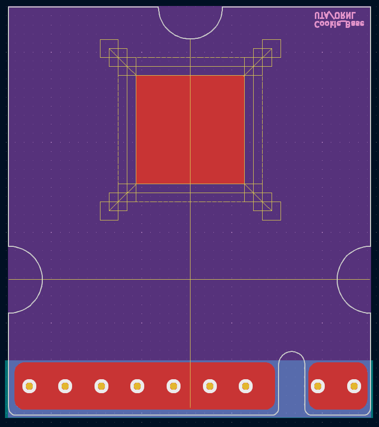
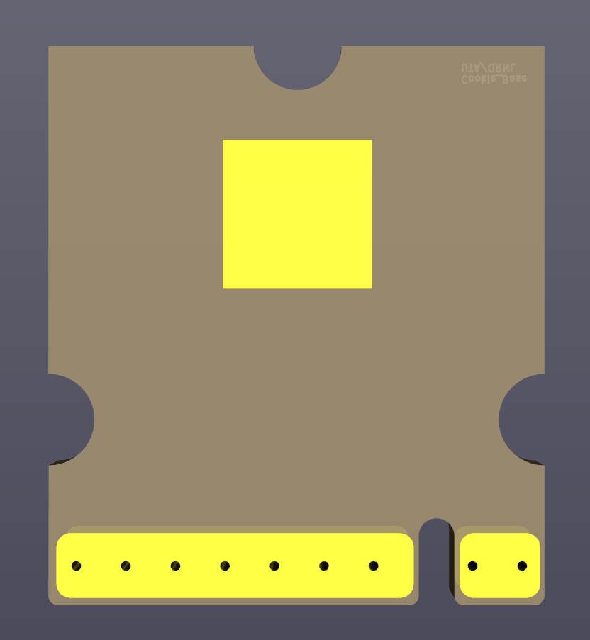
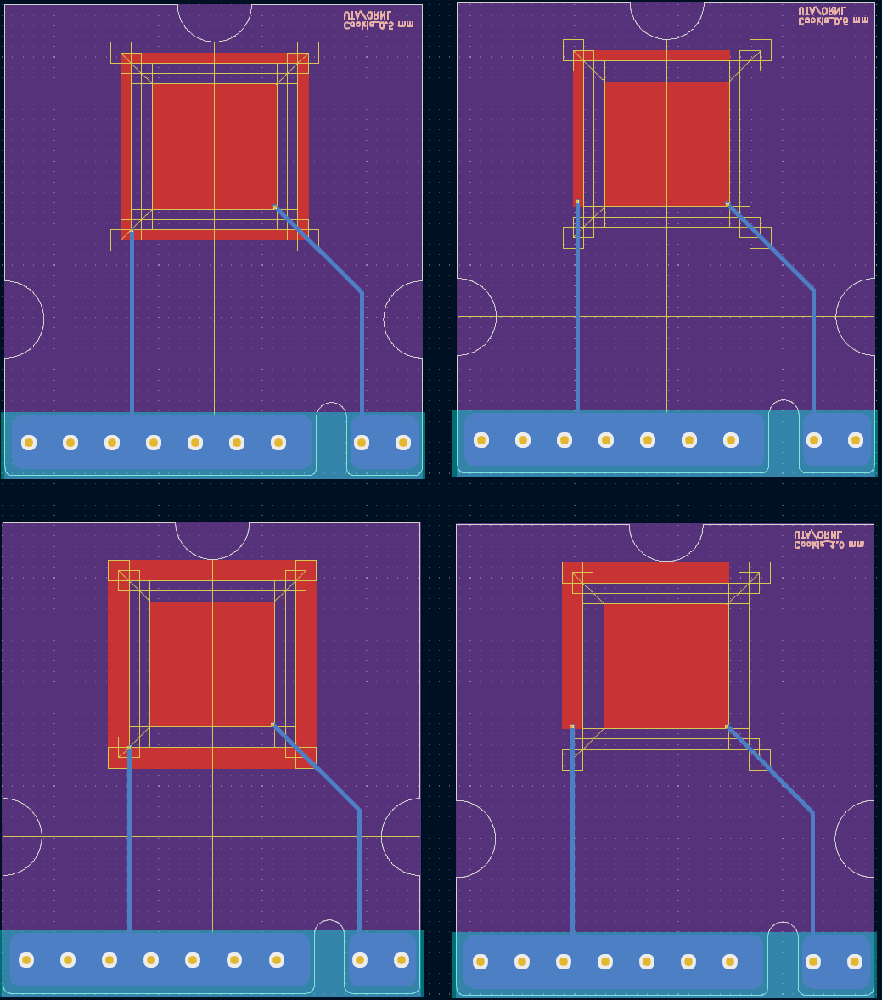
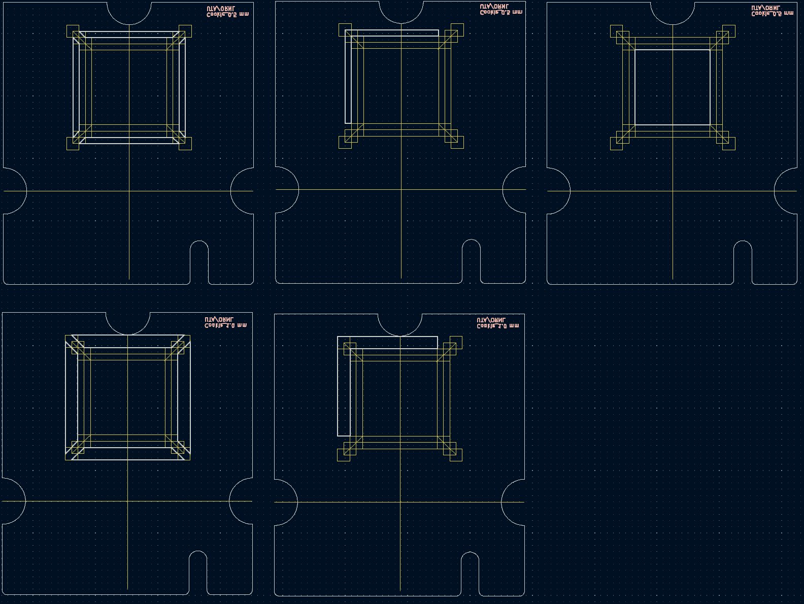
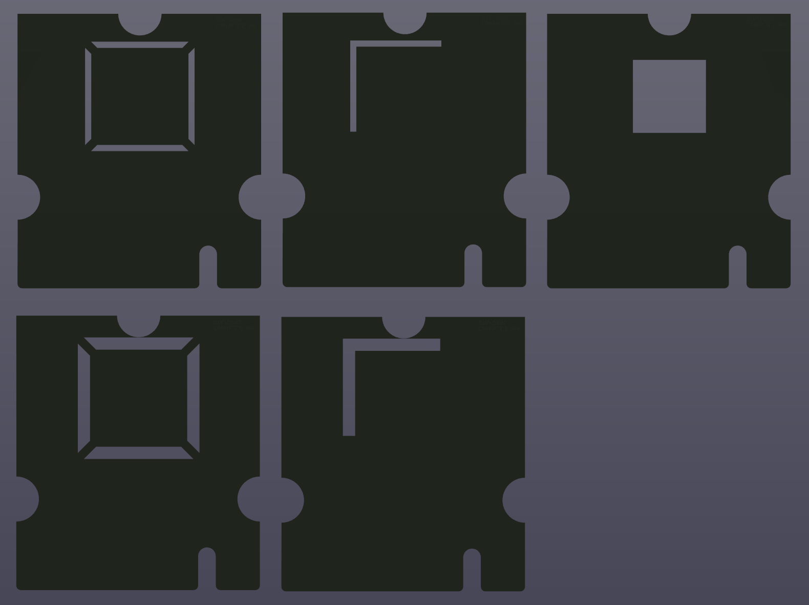
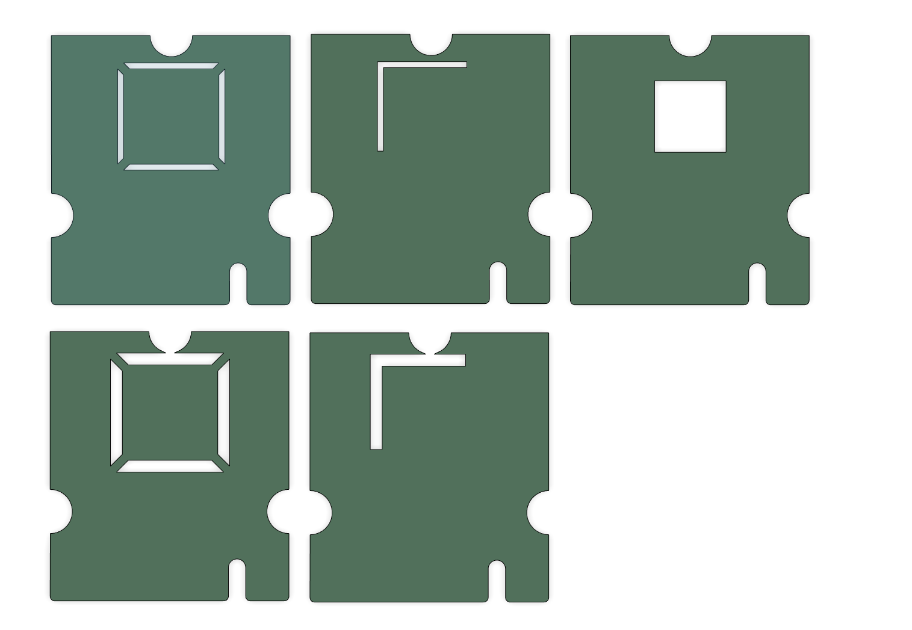
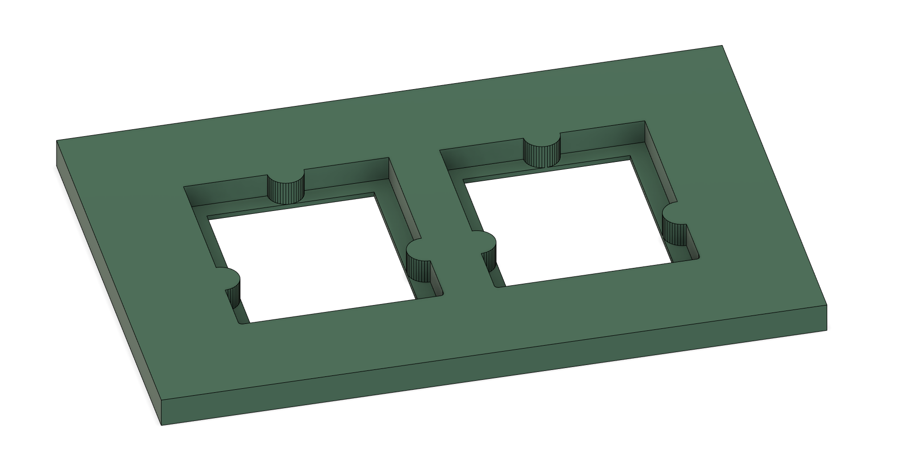
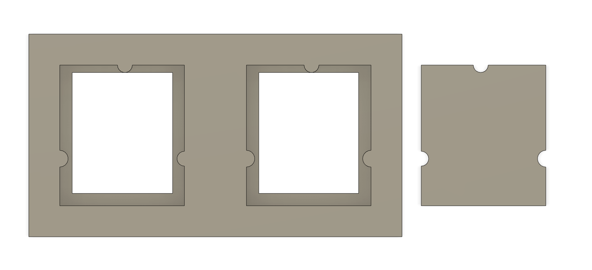

# Cookie Board Variants  
This is a subiteration of the cookie board design
Stencils were made to create protected layers  
  
### ::: Base of the Cookie Board ::: ###  
-6x6 mm pad  
-0.5 mm and 1.0 mm graphic for trace displacement and design  
 
  

### ::: Variants of the Board ::: ###  
-All Boards 1.0 mm distance from pad  
-0.5 and 1.0 mm trace thickness variations  
-Square and L Variation  
 

### ::: PCB Stencils ::: ###  
-Stencils for coating were created per board variation  
 
 
  
### ::: Sheet Metal Stencils ::: ###  
-Sheet Metal stencils were using PCB Step Files  
  
  
### ::: Stencil Holder ::: ###  
-Stencil Holder is used with PCB Stencils or Sheet Metal Stencils  
-2 Stencil Holders were made, one with wiggle room (gray) one with PCB Step Files (Green)  
  
  
  
  
